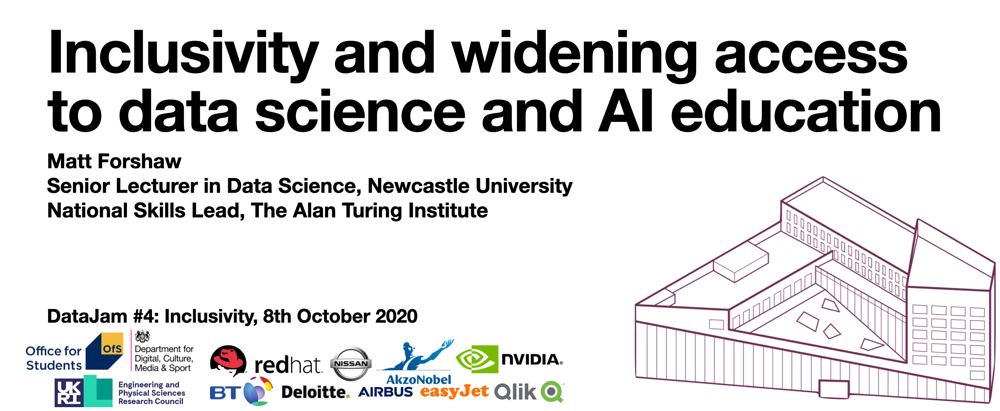
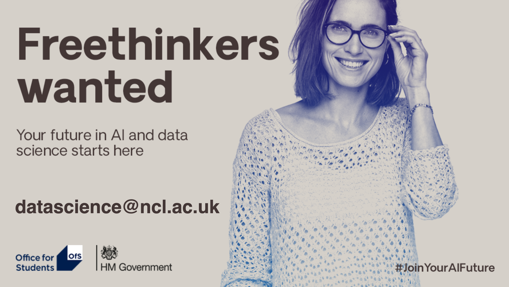

# Inclusivity and widening access to data science and AI education

Slide deck as [PDF](08102020_DataJamInclusivity_SlidesPDF.pdf).

## Links to Resources
- <a href="https://www.youtube.com/watch?v=QxuyfWoVV98" target="_blank">AI, Ain't I A Woman?</a>, Joy Buolamwini
- <a href="https://www.bbc.co.uk/news/technology-54349538" target="_blank">UK passport photo checker shows bias against dark-skinned women</a>, Maryam Ahmed, BBC News

## Suggested Reading
- <a href="https://www.goodreads.com/book/show/28186015-weapons-of-math-destruction">Weapons of Math Destruction: How Big Data Increases Inequality and Threatens Democracy</a>, Cathy O'Neil

## Widening Participation in Data Science and AI
Newcastle University, in collaboration with the Office for Students and Office for AI, is supporting a number of scholarships for <a href="https://www.ncl.ac.uk/postgraduate/courses/degrees/data-science-msc-pgdip-pgcert/">MSc Data Science</a> students for £10,000, that aim to target students often underrepresented in this industry, particularly focusing on female, black and registered disabled students. Other underrepresented categories include: students from POLAR Q1 and Q2, care leavers, estranged students, Gypsy/Roma/traveller students, refugees, children from military families, veterans and partners of military personnel. Students who successfully apply for a scholarship will receive £10,000 to help with the cost of course fees, living expenses and/or associated costs such as childcare and transport. To find out more please contact datascience@ncl.ac.uk.

## Questions, comments and suggestions
I would love to hear from you if you have any questions or comments. Please do not hesitate to contact me via email at matthew.forshaw@ncl.ac.uk or on [Twitter](https://twitter.com/mattforshaw).
